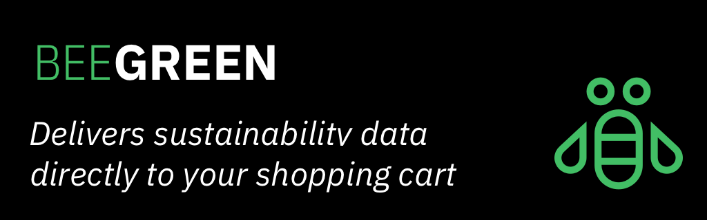
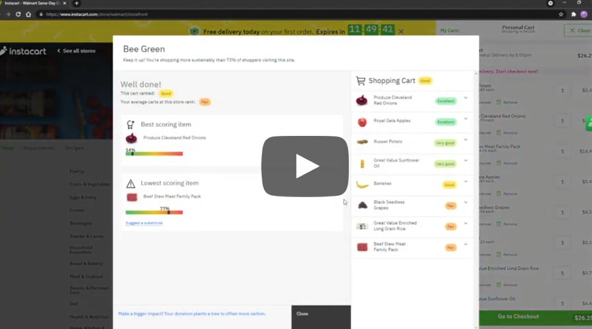
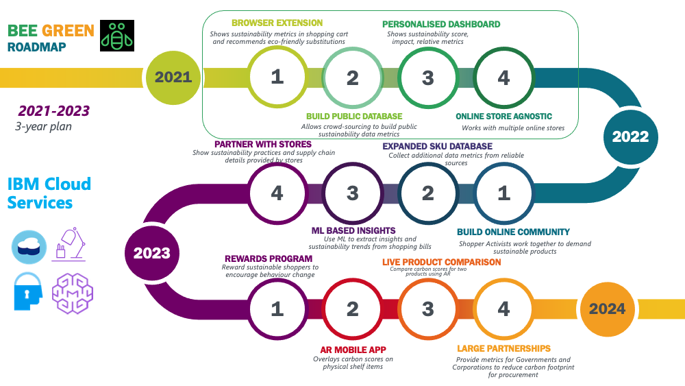

<!-- Header -->
<a href="https://github.com/JessNah/BeeGreen">
    
</a>

<br/>
<br/>

<!-- omit in toc -->
<h1 align="center" style="font-size:42px;border-bottom:none;">
  Bee Green
</h1>
<h3 align="center" style="border-bottom: 1px solid #eaecef;">
  Sustainability in the shopping cart, for conscious choices by consumers.
</h3>


> This package was implemented using [React](https://reactjs.org/), [TypeScript](https://www.typescriptlang.org/), and [LoopBack 4](https://loopback.io/doc/en/lb4/)
> and uses the [IBM Carbon Design System](https://www.carbondesignsystem.com/).
> The database used for all data storage is [IBM Cloudant](https://www.ibm.com/cloud/cloudant).

<!-- Quick Links -->
<div align="center">
<a href="https://youtu.be/Tf7JL9LKUZc">View Demo</a>
·
<a href="https://github.com/narayanacoder/BuildUP/issues">Report Bug</a>
</div>

----

[](https://www.apache.org/licenses/LICENSE-2.0)


## Authors

- [Linda Camillo](https://www.linkedin.com/in/linda-c-3625056/)
- [Narayana Madineni](https://www.linkedin.com/in/narayana-m-696b6230/)
- [Jessica Nahulan](https://www.linkedin.com/in/jessicanahulan/)
- [Jessika Welch](https://www.linkedin.com/in/jessika-welch/)


<!-- omit in toc -->
## Table of Contents
- [Authors](#authors)
- [Overview](#overview)
  - [Problem Background](#problem-background)
- [The Solution](#the-solution)
  - [Demo](#demo)
- [How it works](#how-it-works)
- [Architecture](#architecture)
- [Technology](#technology)
- [Roadmap](#roadmap)
- [Try out our Extension yourself!](#try-out-our-extension-yourself)
- [Contributing](#contributing)
  - [Prerequisites](#prerequisites)
  - [Starting the Extension dev server](#starting-the-extension-dev-server)
  - [Loading The Extension on Chrome](#loading-the-extension-on-chrome)
  - [Provision a CouchDB instance using Cloudant](#provision-a-couchdb-instance-using-cloudant)
  - [Setup the back-end server](#setup-the-back-end-server)
  - [Setup the client site](#setup-the-client-site)
  - [Start the client Bee Green site and the back-end server](#start-the-client-bee-green-site-and-the-back-end-server)
  - [Start contributing code](#start-contributing-code)
    - [1. Understand our Git workflow model](#1-understand-our-git-workflow-model)
    - [2. Always work on a branch](#2-always-work-on-a-branch)
    - [Branch Naming Conventions](#branch-naming-conventions)
- [License](#license)

----

## Overview

### Problem Background

Shopping sustainably is a dynamic endeavor. While people are willing to shop sustainably, there is little information to guide them, and no agreed-upon methodology for defining what "Green" or "Eco-Friendly" means. Manufacturers can exploit this lack of standards to paint a deceptively greener picture than reality. 


This problem is similar to the evolution of "organic" labeling certifications and validation. The time is right to create initial standards as a lens through which to evaluate comparable products. How much water does it take to produce California rice, compared to Iowa rice? How much greenhouse gases do cows emit vs. turkeys? There is a need to benchmark these products starting with consumer staples, and grow the database as the methodology is refined. 

## The Solution

[](https://www.youtube.com/watch?v=gnIpaHCgKZY)

### Bee Green

We propose developing standardized sustainability scores derived from public data, that allow consumers to compare apples to apples, or laptops to laptops, for GHG emissions, excess packaging, distance traveled to market, and other factors required to produce and stock items in stores. 


Our solution Bee Green is a browser plugin that works alongside online shopping applications to educate consumers on the environmental impact of their buying habits, driving behavioral change across society from the grassroots. The goal is to empower users to shop greener and influence retailers to stock the products consumers demand. 


Upon first use, consumers are delighted to shop smarter, greener and address their feelings of guilt and powerlessness through a simple, unobtrusive service with a couple of clicks upon checkout. With repeated use it becomes habit-forming and a fun way to track and grow their influence with shopper comparison and gamification, eventually going viral and helping others relieve guilt and take action.


The solution starts small with a few consumer staple items, then grows to include durables like computers and vehicles, driving long-term, high-impact change. The scope expands to producers, retailers, and transportation.  Change happens at the grass roots, and individuals become part of a larger movement to revolutionize societal behaviors and bring about change.


Bee Green supports crowd-sourcing to build a public database. The next phase is to partner with retailers to share additional sustainability practices associated with their product mix, and to augment the data set. It will grow an online community of consumer-activists that work together to demand sustainable products. The third phase is a mobile app for in-store shopping, with augmented reality  that reveals carbon scores of products on the shelf. 


A proposed outcome of our solution is to create a community of climate activists who act with their wallets. At all stages on the roadmap, Bee Green interfaces will surface key sustainability data in a digestible format, and at the appropriate time, to enable any consumer to be a climate activist. Armed with sustainability metrics, shoppers reward producers and transport companies who operate sustainably. Conversely, they also pass over those producers and transporters who do not operate sustainably, withholding their consumer purchasing power from these "eco-villains".

## How it works

## Architecture


Bee Green combines a recommendation and cataloging system (Watson Studio), Cloudant data storage to hold the carbon scoring dataset, and a React-Typescript website and chrome extension to get users the information they need as they shop on their favorite online stores. A LoopBack4 backend is used to get users the information they need from the dataset and support the website's queries.


## Technology

- [IBM Cloud](https://www.ibm.com/cloud)
- [Watson Studio](https://dataplatform.cloud.ibm.com/docs/content/wsj/getting-started/welcome-main.html)
- [IBM Cloudant](https://cloud.ibm.com/docs/Cloudant?topic=cloudant-overview)
- [Node.js](https://nodejs.org)
- [React](https://reactjs.org//)
- [TypeScript](https://www.typescriptlang.org/)
- [LoopBack 4](https://loopback.io/doc/en/lb4/)

## Roadmap



Short term
BROWSER EXTENSION - Shows sustainability metrics in shopping cart and recommends eco-friendly substitutions
BUILD PUBLIC DATABASE - Allows crowd-sourcing to build public sustainability data metrics
PERSONALISED DASHBOARD - Shows sustainability score, impact, relative metrics
ONLINE STORE AGNOSTIC - Works with multiple online stores


Mid-term
BUILD ONLINE COMMUNITY - Shopper Activists work together to demand sustainable products
Expanded SKU database - Collect additional data metrics from reliable sources
ML INSIGHTS - Use ML to extract insights and sustainability trends from shopping bills
PARTNER WITH STORES -  Show sustainability practices and supply chain details provided by stores


Long-term
REWARDS PROGRAM - Reward sustainable shoppers to encourage behaviour change
AR MOBILE APP -  Overlays carbon scores on physical shelf items
LIVE PRODUCT COMPARISON - Compare carbon scores for two products using AR
LARGE PARTNERSHIPS - Provide metrics for governments and corporates for procurement

## Try out our Extension yourself!

Do you want to try out our extension and get a preview of the experience, without needing to connect to a server and without having to set up a dev environment? Then follow these steps:

1. Download the `Extension/distProduction` zip file found in this repository, and unzip the folder.
2. Open Chrome and navigate to `chrome://extensions/`
3. Toggle on `Developer mode` in the top right corner
4. Click `Load unpacked`
5. Select the entire `distProduction` folder

**Note: For real data, you'd have to follow the instructions in the contributing section, as you'd need to connect to a database.

## Contributing

### Prerequisites

Before contributing to this repository, you will need the following tools installed:

- Register for an [IBM Cloud](https://www.ibm.com/account/reg/us-en/signup?formid=urx-42793&eventid=cfc-2020?cm_mmc=OSocial_Blog-_-Audience+Developer_Developer+Conversation-_-WW_WW-_-cfc-2020-ghub-starterkit-cooperation_ov75914&cm_mmca1=000039JL&cm_mmca2=10008917) account.
- Install and configure [IBM Cloud CLI](https://cloud.ibm.com/docs/cli?topic=cloud-cli-getting-started#overview).
- Clone this repo [repository](https://github.com/JessNah/BeeGreen)
- [Node.js](https://nodejs.org/en/download/) (We recommended using v10 or above).
   Click [here](https://nodejs.org/en/download/package-manager/) if you wish to install via package manager.
  - If you're on a macOS, we recommend using
    [`nvm`](https://github.com/nvm-sh/nvm) to help manage different versions of
    Node.js
- [Git](https://git-scm.com/download/win). Learn more about Git [here](https://www.atlassian.com/git/tutorials/what-is-git).

### Starting the Extension dev server

To test your changes, navigate to the Extension folder in your local cloned repo directory, ie. `Github/BeeGreen/Extension`, and then you will need to run:

```
npm install
npm run start
```

This will build and transpile the Extension code, the output will be placed in the `Extension/dist` folder.

If you do not have the database up and connected to the server code, and do not wish to use the real data from the database, then you'd need to first navigate to `Extension/src/settings.ts` and update the `devMode` attribute to `true` before you run the above commands. Otherwise you could follow the steps below to get your server and database up and working.

### Loading The Extension on Chrome

1. Open Chrome and navigate to `chrome://extensions/`
2. Toggle on `Developer mode` in the top right corner
3. Click `Load unpacked`
4. Select the entire `dist` folder

### Provision a CouchDB instance using Cloudant

Log into the IBM Cloud and provision a [CouchDB instance using Cloudant](https://www.ibm.com/cloud/cloudant).

1. From the catalog, select Databases and then the Cloudant panel.
1. Once selected, you can choose your Cloudant plan -- there is a free tier for simple testing that is sufficient to run this CIR example. You should choose an appropriate region, give the service a name, and it is recommended you choose **Use only IAM** under **Available authentication methods**. You can leave the other settings with their defaults. Click the blue **Create** button when ready.
1. Once your Cloudant instance has been created, you need to create a service credential that the CIR API Server can use to communicate with it. By selecting your running Cloudant instance, you can choose **Service credentials** from the left-hand menu. Create a new service credential and give it a name (it doesn't matter what you call it).
1. Once created, you can display the credentials by selecting **view service credentials**, and then copy the credential, so you are ready to paste it into the code of the API server in the next step.

### Setup the back-end server

To set up and launch the server application:

1. Go to the `BeeGreen/Server` directory of the cloned repo.
2. Update the fields in BeeGreen/Server/src/datasources/beegreendb.datasource with the values created in the previous step.
   
```
{
  name: 'beegreendb',
  connector: 'cloudant',
  url: 'xxx',
  database: 'beegreendb',
  username: 'xxx',
  password: 'xxx',
  modelIndex: 'loopback__model__beegreendb',
  globalLimit: 1000
};
```

3. Run the following command

```
npm install
```

### Setup the client site

From a terminal:

  1. Go to the `BeeGreen/Client` directory of the cloned repo.
  2. Install the dependencies: `npm install`.

### Start the client Bee Green site and the back-end server

 1. Go to the Go to the `BeeGreen/Client` directory of the cloned repo.
 2. Launch the server application locally or deploy to IBM Cloud:
     - To run locally:
         1. Start the application: `npm start`.
         2. The client server can be accessed at <http://localhost:3000>.
         3. The back-end server can be accessed at <http://localhost:3001>.
     - To deploy to IBM Cloud:
         1. Log in to your IBM Cloud account using the IBM Cloud CLI: `ibmcloud login`.
         2. Target a Cloud Foundry org and space: `ibmcloud target --cf`.
         3. Push the app to IBM Cloud: `ibmcloud app push`.
         4. The server can be accessed at a URL using the **name** given in the `manifest.yml` file (for example,  <https://my-app-name.bluemix.net>).

### Start contributing code

#### 1. Understand our Git workflow model

When it comes to code contributions, we generally follow the Gitflow workflow model: https://www.atlassian.com/git/tutorials/comparing-workflows/gitflow-workflow.

#### 2. Always work on a branch

When contributing to this package, your work should always be done in a new branch. We use feature branches.

What are feature branches: https://www.atlassian.com/git/tutorials/comparing-workflows/feature-branch-workflow

Each new feature should always reside in its own branch. When a feature is complete, it gets merged back into the master branch.

When your work is done, submit your pull request and once it has been approved, you can merge your branch.


#### Branch Naming Conventions
Follow this pattern exactly so that searching is easier:
`<prefix>/<summary>` 

Prefix  |   Use Case
---     |   ---
feature |   New feature addition
defect	|   Bug or defect fix
wip	    |   Works in progress
junk    |	  Throwaway branch created to experiment

Example branch name:

```bash
feature/rewards-page
```

## License

Bee Green is made available under the [Apache 2 License](LICENSE).
